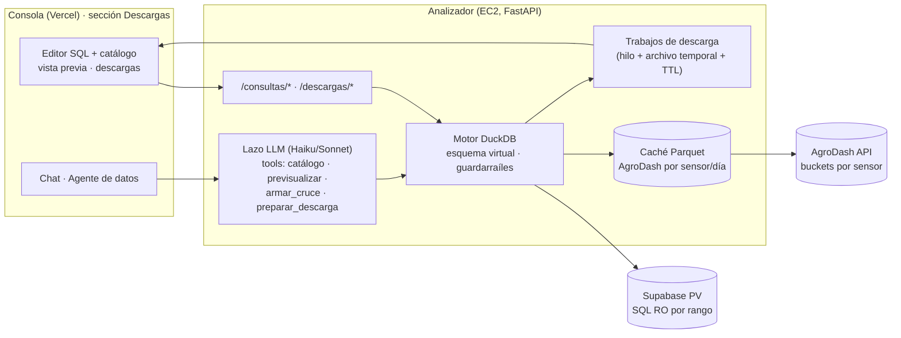

# Consultas cruzadas entre fuentes + agente de descargas — diseño

**Estado:** propuesta del 2026-09-11, **antes de implementar**. Pedido de Isaac: *"algo que permita
hacer joins entre fuentes, Cartago y San Carlos, que con un agente ahí mismo se pueda descargar la
data (él la brinde con algún tool) y que se permitan consultas personalizadas"*.

Parte de lo que ya existe: la sección **Descargas** ([[mvp-debugger]] §2026-09-11) exporta UNA tabla de
UNA fuente por rango. Lo nuevo es cruzar fuentes, escribir consultas y que un agente lo haga por vos.

---

## 1. El problema de fondo

Las dos fuentes viven en sitios distintos y no se pueden unir con un `JOIN` de Postgres:

| Fuente | Dónde | Cómo se llega | Forma | Reloj |
|---|---|---|---|---|
| Supabase PV (San Carlos) | Postgres en Supabase | SQL (pool RO del analizador) | ancha, 5 min / 15 s | local etiquetado +00 (PV); UTC real (store ambiental) |
| AgroDash (Cartago + SC) | Postgres privado (Tailscale) | **solo por su API pública** (buckets por sensor) | larga: 1 fila = 1 lectura de 1 sensor | local naive |

Además un "join" entre series de sensores nunca es por igualdad de timestamp: las cadencias difieren
(5 min vs 1–3 min vs 15 s) y los relojes se etiquetan distinto ([[reloj-timestamps]]). El join útil es
**por intervalo de tiempo** (remuestrear ambas a un paso común y unir por el bucket) y, para AgroDash,
**pivotar** de largo a ancho (un sensor = una columna).

## 2. Decisión central: DuckDB como capa federada en el analizador

**Traer los pedazos de cada fuente al servicio (ya filtrados por rango) y unirlos en un motor SQL
embebido (DuckDB), en memoria y de solo lectura.** El usuario o el agente escriben SQL contra un
**esquema virtual** que el servicio expone; el servicio decide qué pedir a cada fuente.

Por qué DuckDB y no otra cosa:
- Es SQL completo (joins, window functions, `time_bucket`, pivot) sobre datos en memoria/Arrow, sin
  servidor ni infra nueva. Corre dentro del contenedor del analizador (EC2, 3,8 GB RAM).
- Sandbox natural: `enable_external_access=false` (no lee archivos ni red), `memory_limit`, `threads`,
  interrupción por tiempo. Nada de lo que escriba el LLM toca Supabase ni AgroDash directamente.
- Los serializadores csv/dat/mat de `exportar.py` se reusan tal cual (reciben un iterador de filas).

**Alternativas descartadas**
| Alternativa | Por qué no |
|---|---|
| Replicar AgroDash entero en Supabase y unir en Postgres | La Supabase Free está al 79 % de 500 MB; AgroDash pesa 5 GB / 21 M filas ([[cuota-store-supabase]], [[agrodash-local]]). Ni una réplica a 5 min cabe. |
| `postgres_fdw` / Wrappers de Supabase hacia AgroDash | La DB de AgroDash es privada (Tailscale); Supabase cloud no la alcanza. Y tampoco se puede desde la EC2 hoy (la réplica desapareció, [[estado-ec2-2026-09-11]]). |
| Joins en pandas "a mano" con parámetros fijos | No permite consultas personalizadas; cada combinación nueva es código nuevo. |
| Dejar que el LLM ejecute SQL directo contra Supabase | Rompe el borde de seguridad actual (allowlist de `datos.py`); un `SELECT` malo puede tumbar el pooler o vaciar la cuota de egress. |

## 3. Arquitectura



**Flujo de una consulta** (humana o del agente):
1. `POST /consultas/previa {sql, rango}` → el motor **parsea** el SQL, valida que sea un único `SELECT`
   sobre el esquema virtual, **extrae qué vistas toca** y **exige un rango de fechas** (global o por
   `WHERE`); carga de cada fuente solo ese rango; ejecuta con `LIMIT 50`; devuelve columnas, filas de
   muestra, conteo estimado y tiempo.
2. `POST /descargas {sql, rango, formato}` → crea un **trabajo** (id); un hilo ejecuta la consulta
   completa por lotes y escribe el archivo en `/tmp/descargas/<id>.<ext>`; `GET /descargas/{id}` da
   progreso (`filas`, `bytes`, `estado`); `GET /descargas/{id}/archivo` lo sirve (adjunto). TTL 1 h.
   Esto también resuelve el límite de 60 s de nginx que hoy afecta a los `.mat` grandes.
3. El chat: el agente usa las **mismas** rutas por sus tools y devuelve marcadores `_consulta`
   (SQL propuesto → botón "poner en el editor") y `_descarga` (id → botón de descarga con progreso).
   El humano siempre ve el SQL antes de bajar nada.

## 4. Esquema virtual (lo único que se puede consultar)

Todas las vistas salen **ya normalizadas**: hora local CR naive (`t`), columna `sitio`
(`san_carlos` | `cartago`), unidades en el nombre. Dos familias por fuente:

**Supabase PV (`sc.*`)** — las 10 relaciones actuales de la allowlist, tal cual, más versiones
remuestreadas: `sc.electrico_5m`, `sc.radiacion_15s`, `sc.radiacion_5m`, `sc.performance_5m`,
`sc.ambiental_5m` (store, pivotado por caja/variable).

**AgroDash (`agrodash.*`)**
- `agrodash.lecturas` — largo: `t, sitio, caja, sensor_numero, sensor_tipo, sensor_id, valor, n, minimo, maximo, desvio`.
- `agrodash.ancha_<paso>` — pivot: una columna por `caja · tipo · numero`
  (p. ej. `caja_abioticos_1_sc__humedadSuelo_1`), a paso 5m/15m/1h/1d. Se genera bajo demanda para
  las cajas/tipos que la consulta nombra (no 491 columnas siempre).
- `agrodash.sensores` — catálogo.

**Alineación temporal:** función de servicio `bucket(t, paso)` = `time_bucket` de DuckDB; las vistas
`_<paso>` ya vienen agregadas (promedio, más `n`, `min`, `max`). Un join típico:

```sql
SELECT e.t, e.potencia_total_wac, r.irradiancia_incidente_wm2,
       a.caja_abioticos_1_sc__humedadSuelo_1 AS hum_suelo_sc,
       c.caja_s__calibrada_3 AS hum_calibrada_cartago
FROM sc.electrico_5m e
JOIN sc.radiacion_5m r USING (t)
LEFT JOIN agrodash.ancha_5m a USING (t)
LEFT JOIN agrodash.ancha_5m c USING (t)
WHERE t BETWEEN '2026-05-01' AND '2026-05-31'
```

**Mapeo caja → sitio:** heurística `nombre contiene "SC"` → `san_carlos`, resto `cartago`, con tabla
de excepciones versionada (`sitios_cajas.yaml`). Es el mismo bloqueante fino del Comparador
([[bloqueantes]]); acá se resuelve "suficiente" y se corrige con la lista del equipo.

## 5. Guardarraíles (el borde de seguridad)

- **Un solo `SELECT`** (se rechaza `;`, `COPY`, `ATTACH`, `INSTALL`, `PRAGMA`, `SET`, DDL/DML).
  Verificado con el parser de DuckDB (`extract_statements` + tipo de sentencia), no con regex.
- **Solo el esquema virtual**: las vistas se registran en una conexión nueva por consulta; no hay
  tablas base ni acceso a archivos (`enable_external_access=false`, `lock_configuration=true`).
- **Rango obligatorio** y acotado (p. ej. ≤ 366 días; ≤ 31 días si entra `radiacion_15s` o AgroDash crudo).
- **Cuotas por consulta:** `memory_limit` 1 GB, tiempo 60 s para previa / 15 min para descarga
  (interrupción), filas ≤ 2 M (csv/dat) / 500 k (mat), tamaño ≤ 200 MB, ≤ 3 trabajos simultáneos
  (ya existe el semáforo), ≤ 1 trabajo por usuario de chat.
- **Lo que llega a las fuentes** sigue siendo lo de hoy: SQL parametrizado por rango sobre la allowlist
  (Supabase) y llamadas a la API por sensor/tramo (AgroDash). El SQL del usuario **nunca** sale del motor.
- Fase 3: ejecutar el motor en un **subproceso** con `RLIMIT_AS` y kill por tiempo (aísla fugas de memoria).

## 6. El agente de datos

Vive en el analizador (mismo lazo tool-use de [[agente-analizador]]; el chat de la consola ya manda el
contexto de la vista). Se activa en la sección Descargas con un system prompt propio y **cuatro tools**:

| Tool | Hace | Devuelve al LLM |
|---|---|---|
| `catalogo_datos(fuente?, buscar?)` | vistas, columnas, unidades, cobertura, cajas/tipos | resumen compacto (no 491 sensores de golpe: paginado/buscable) |
| `armar_cruce(variables_sc[], sensores_agrodash[], paso, desde, hasta)` | genera el SQL del join alineado (plantilla, no "creatividad") | `{sql}` + marcador `_consulta` |
| `previsualizar(sql, desde, hasta)` | valida + ejecuta con `LIMIT 20` | columnas, 20 filas, conteo, error legible (para que se corrija solo) |
| `preparar_descarga(sql, desde, hasta, formato)` | crea el trabajo | `{descarga_id, filas_estimadas}` + marcador `_descarga` |

Reglas del prompt: **siempre** previsualizar antes de preparar; nunca inventar columnas (usar el
catálogo); explicar en una línea qué se unió y con qué paso; si el pedido es ambiguo (¿qué caja de
Cartago?), preguntar. Modelo: Haiku 4.5 orquesta bien tools; para SQL libre conviene **Sonnet 5** —
propuesta: Haiku por defecto y Sonnet solo cuando `armar_cruce` no alcanza (consulta libre). Costo
estimado por conversación: < US$0,05.

Ejemplo:
> *"Bajame en CSV mayo 2026: potencia AC de San Carlos con la humedad de suelo de la Caja Abioticos 1 SC y la de la Caja S de Cartago, cada 15 minutos."*
> → `catalogo_datos` (resuelve nombres) → `armar_cruce(...)` → `previsualizar` (20 filas, 2 976 est.) → `preparar_descarga(csv)` → *"Listo: 2 976 filas, 15 min, join por intervalo. [Descargar cruce_2026-05.csv]"*

## 7. Interfaz (sección Descargas)

Se agrega un modo **"Consulta"** junto al actual "Tabla": a la izquierda, catálogo navegable (mismo
`Picker` con búsqueda) que inserta nombres en un **editor SQL** con plantillas ("cruce SC + Cartago a
5 min"); a la derecha, el panel fijo de siempre con vista previa, estimación y el botón, que ahora crea
un **trabajo** y muestra progreso (filas, MB) hasta ofrecer el archivo. Una lista "Mis descargas"
(en memoria del navegador + estado del servidor) para volver a bajar dentro del TTL. El chat flotante
ya existe: solo se agregan los dos marcadores.

## 8. Fases

| Fase | Entrega | Esfuerzo |
|---|---|---|
| **1 · Motor + trabajos** | `motor.py` (DuckDB, esquema virtual, guardarraíles), `/consultas/previa`, `/descargas` (jobs), editor SQL + vista previa + descargas con progreso. Sin agente. | 3–4 días |
| **2 · Agente** | 4 tools, prompt, marcadores `_consulta`/`_descarga` en el chat, contexto de vista. | 2 días |
| **3 · Rendimiento y aislamiento** | caché Parquet de AgroDash (por sensor y día; el día actual con TTL), subproceso con límites, `postgres` extension de DuckDB con pushdown a Supabase (evita traer columnas no usadas). | 2–3 días |

Dependencias nuevas del analizador: `duckdb`, `pyarrow` (y `pandas` que ya trae el pronóstico).

## 9. Riesgos y cómo se mitigan

- **Egress de Supabase / carga a AgroDash:** rango obligatorio + cuotas + caché Parquet.
- **SQL del LLM equivocado:** el lazo `previsualizar` → error legible → corrección; el humano ve el SQL.
- **Memoria en la EC2 (3,8 GB, comparte con el runtime):** `memory_limit` + tope de trabajos + subproceso.
- **Relojes:** normalización única al cargar (regla por fuente de [[reloj-timestamps]]); tests fijan
  que un cruce a 5 min alinea el pico solar de ambas fuentes a la misma hora.
- **Mapeo caja→sitio incompleto:** heurística "SC" + excepciones; se marca en el catálogo como
  `sitio_inferido` hasta tener la lista del equipo.
- **nginx 60 s:** nada pesado corre síncrono; todo es trabajo + polling.

## 10. Preguntas para decidir antes de implementar

1. ¿Va **dentro del analizador** (propuesta: sí, reusa pool, tools, chat y deploy) o como un tercer
   servicio "agente de datos"?
2. ¿Aceptás **DuckDB** como motor (dependencia nueva, ~40 MB en la imagen)?
3. **Cuotas**: ¿366 días / 2 M filas / 200 MB / TTL 1 h te parecen bien?
4. ¿Modelo para SQL libre: Haiku (barato) o Sonnet 5 (mejor SQL)?
5. ¿Las descargas quedan **solo para usuarios logueados** de la consola (hoy sí) o también por API con
   clave para scripts del equipo?
6. ¿Tenés la **lista caja → sitio** o seguimos con la heurística "SC"?

Relacionado: [[mvp-debugger]], [[agente-analizador]], [[capa-agentes]], [[arquitectura-regiones]],
[[reloj-timestamps]], [[estado-ec2-2026-09-11]].
