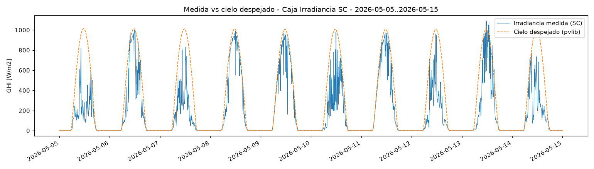
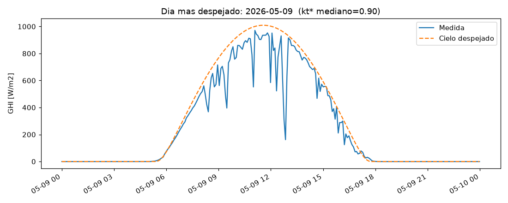
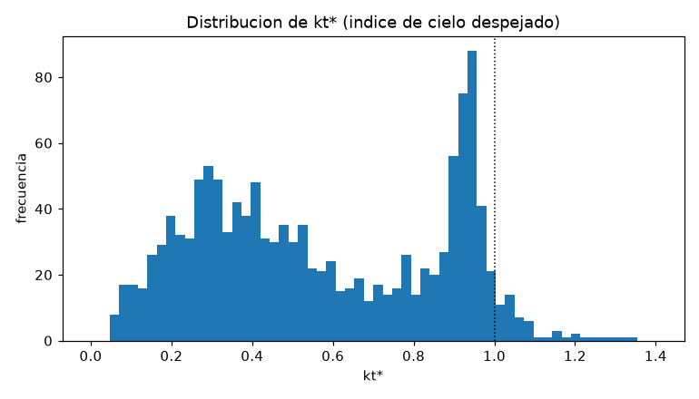

# 01 — Validación de la capa física (clear-sky + kt*)

**Fecha:** 2026-06-30 · **Código:** `agente-pronostico/scripts/validar_fisica.py` · **Datos:** `Caja Irradiancia SC` (AgroDash, solo lectura)

## Por qué este paso primero
Antes de construir el agente conviene comprobar —barato— que la **descomposición por cielo
despejado** funciona sobre los datos reales. Es el cimiento del forecaster: si la física está mal
enchufada (sobre todo el *timezone*), cualquier modelo encima hereda el error. Este paso valida tres
cosas de un solo vistazo y de-riesga el resto del proyecto.

## Método
1. Traemos 10 días (2026-05-05 a 05-15) de un canal de irradiancia de `Caja Irradiancia SC` (el de
   más datos: 2.670 lecturas a 5 min). Consulta **solo-lectura** (`SET TRANSACTION READ ONLY`).
2. Etiquetamos el tiempo como **hora local (UTC−6, `America/Costa_Rica`)** — los timestamps de
   AgroDash vienen sin zona pero son locales.
3. Calculamos la **GHI de cielo despejado** con `pvlib` (modelo Ineichen + turbidez Linke
   climatológica) para San Carlos (~10,33°N, −84,42°O).
4. Calculamos **kt\* = GHI_medida / GHI_cieloclaro** (solo de día).

## Resultados

### 1. Fase / timezone ✅
El pico medio de irradiancia **medida** y el del **cielo despejado** caen ambos a las **11 h**
locales. Si hubiera un error de timezone estarían corridos ~6 h.

*10 días: la campana naranja (cielo despejado) marca el techo teórico de cada día; la línea azul
(medida) lo sigue en fase, cayendo con las nubes. Patrón típico de sitio tropical variable.*

### 2. Magnitud / calibración ✅
El pico de cielo despejado (~1.013 W/m²) actúa como **envolvente superior**; los momentos despejados
de la medida llegan a ~0,9–0,95 de ese techo. Que la medida ronde valores físicos (~1.000 W/m²)
confirma que **ya está en W/m²**, no en cuentas crudas.

*El día "más despejado" de la ventana (2026-05-09, kt\* mediano 0,90). Ni el mejor día está limpio:
hay caídas por nubes convectivas. Aun así la medida abraza la envolvente de cielo despejado.*

### 3. kt\* sano ✅
kt\* cae en **[0, 1.2] el 99,2 %** del tiempo; mediana 0,51, p90 0,95. La distribución es bimodal:
un lomo ancho (0,1–0,7) de condiciones nubladas y un **pico marcado en ~0,9–0,95** (momentos
despejados, el "techo" de cielo despejado), con una cola pequeña >1 por realce de nubes.

*kt\* aísla el efecto de las nubes del ciclo solar determinista: es acotado y casi estacionario —
justo lo que hace falta para pronosticar.*

## Veredicto
**Física validada.** Timezone correcto, datos en W/m², kt\* bien comportado. El cimiento del
forecaster (persistencia inteligente sobre kt\*) es viable sobre estos datos.

**Hallazgo relevante para la investigación:** el sitio es **muy nuboso** (mediana kt\* 0,51; sin día
pristino en 10). Eso hace el problema **genuinamente difícil** —mucha variabilidad estocástica de
nubes— que es exactamente el régimen donde la descomposición clear-sky y la comparación
LLM-vs-estadístico tienen algo que demostrar.

**Refinamiento opcional (no bloquea):** afinar altitud/turbidez para que el modo de kt\* despejado
quede aún más cerca de 1,0. Hoy la envolvente ya se comporta bien.

## Siguiente
Refactorizar la física validada a `physics.py` + `data.py` (con filtrado `timestamp < t_now` para el
backtest sin fuga) y construir el forecaster de persistencia inteligente + un primer **hindcast**
(fijar un "ahora" en el pasado, predecir a +h, comparar con el real).
