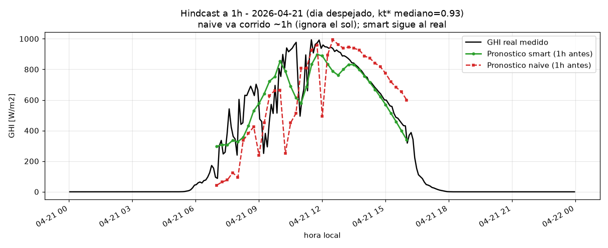
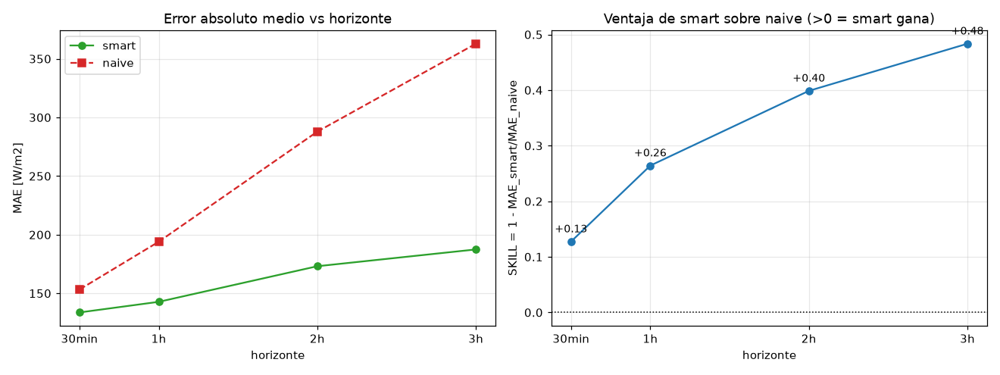

# 02 — Forecaster de persistencia inteligente + hindcast

**Fecha:** 2026-06-30 · **Código:** `agente-pronostico/src/pronostico/{data,physics,forecasters/persistence}.py` + `scripts/hindcast_demo.py`

## Qué construimos
Sobre la física ya validada (ver `01-validacion-fisica.md`), el primer pronosticador y su banco de pruebas:
- **`data.py`** — capa de datos solo-lectura: descarga una vez de AgroDash y cachea en parquet
  (`data/pronostico/irradiancia_sc.parquet`); `get_recent_data(now, lookback)` es la **barrera
  anti-fuga**: solo devuelve lecturas con `timestamp < now`.
- **`physics.py`** — `clear_sky_ghi`, `clear_sky_index` (kt*), `reconstruct_ghi`.
- **`forecasters/persistence.py`** — `smart_persistence` (media de kt* reciente × clear-sky futuro) y
  `naive_persistence` (repite el último valor; rival tonto).
- **`hindcast_demo.py`** — reloj simulado: 1.118 instantes t_now (7h–16h) en 2026-03-10→06-30,
  horizontes 30min/1h/2h/3h, comparando contra el valor real. Sin fuga; el clear-sky futuro sí es lícito.

## Resultados (reales)

| Horizonte | N | MAE smart | MAE naive | SKILL (1−smart/naive) |
|---|---|---|---|---|
| 30 min | 863 | 133.7 | 153.2 | +0,13 |
| 1 h | 861 | 142.8 | 194.0 | +0,26 |
| 2 h | 770 | 173.1 | 287.9 | +0,40 |
| 3 h | 678 | 187.4 | 362.9 | +0,48 |

(MAE en W/m². Skill > 0 = smart mejor.)

*Día despejado (21-abr), horizonte 1h: el naive (rojo) va corrido ~1h; el smart (verde) sigue al real (negro).*

*El error del naive se dispara con el horizonte; el del smart crece despacio. La ventaja del smart va de +0,13 (30min) a +0,48 (3h).*

## Interpretación
- **Smart gana en todos los horizontes y la ventaja crece con el horizonte.** El naive ignora el
  movimiento del sol (error 153→363); el smart reinyecta la geometría solar vía clear-sky (134→187).
  A 30 min el sol casi no se mueve → ventaja modesta (viene de suavizar kt*).
- **Caveats:** MAE absoluto alto (~130–190) porque el sitio es muy nuboso y la variabilidad intra-hora
  de kt* es irreducible para una persistencia — **ese es el hueco que un forecaster mejor / el agente
  debe atacar**. N baja con el horizonte (t_now de tarde proyectan a la noche). Emparejamiento al real
  ±4 min (cadencia ~5,5 min): desalineación despreciable.
- Sin escrituras a la DB; sin fuga (verificado: para now=10:00 la última lectura vista es 09:59:01).

## Siguiente
Fase 2: sustituir la persistencia por un forecaster serio (AutoARIMA / boosting / foundation model)
manteniendo la interfaz `forecast(variable, horizon_seconds, now)`, e intervalos de incertidumbre
calibrados (conformal, MAPIE). Y montar el agente LLM (`agent.py`) que orquesta esa herramienta y
responde en lenguaje natural.
